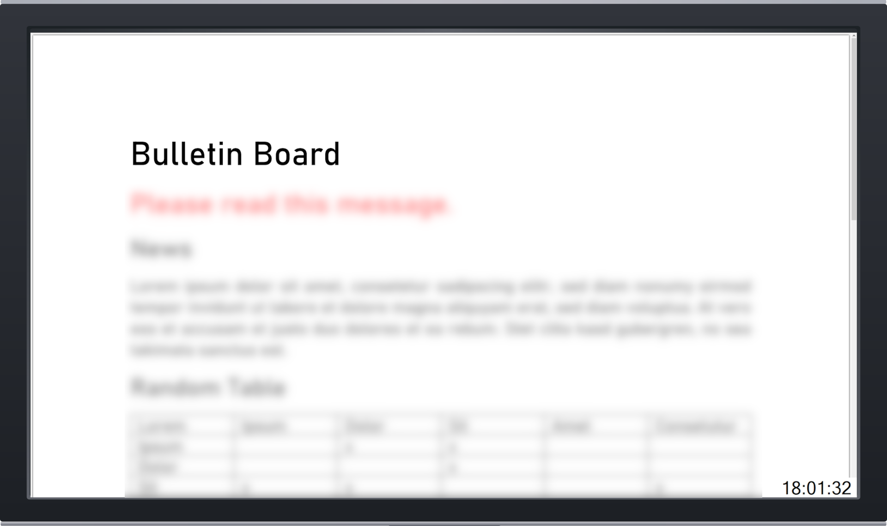

# SchoolDisplay

**Ein deutsches Handbuch ist [hier](docs/README_DE.md) verfügbar.**

An easy-to-use digital bulletin board designed for schools.

## How does it work?

This Windows application displays successively and repeatedly all PDF files in a configured directory in full screen mode and scrolls through them from top to bottom. It is also possible to use [UNC paths](https://en.wikipedia.org/wiki/Path_(computing)#Universal_Naming_Convention) that refer to network shares - changes are applied in real-time.

SchoolDisplay is a fully featured digital bulletin board - for example for use in schools. :de:

## Getting Started
### Prerequisites
* Operating System: **Microsoft Windows** (Windows 10 is recommended)
* [**.NET Framework 4.8**](https://dotnet.microsoft.com/download/dotnet-framework/thank-you/net48-web-installer) ([preinstalled on some versions of Windows 10](https://docs.microsoft.com/en-us/dotnet/framework/get-started/system-requirements))

### Installation
1. Download the [latest release](https://github.com/ytausch/SchoolDisplay/releases) (`SchoolDisplay_x.y.z.zip`) and unzip it
2. Edit the configuration file `SchoolDisplay.exe.config` - make sure to change `PdfDirectoryPath` and your display times.
3. Run `SchoolDisplay.exe` and have some fun! :tada:

### Usage
Just change the files in your `PdfDirectoryPath` (you should probably use a network share to do that). The screen contents will update in real-time.
